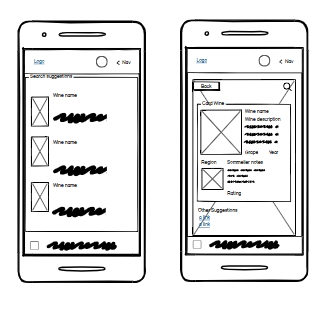
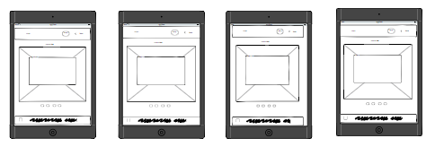
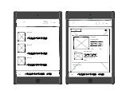
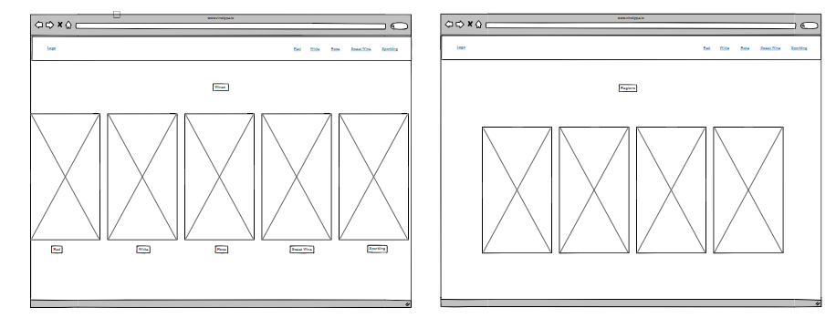

# Vinotype

Vinotype is your pocket sommelier, helping you discover wines you will absolutely love. Our personalised recommendations and notes unlock a world of delicious wines, ensuring every bottle is a delightful discovery. Experience the joy of finding wines you truly adore with Vinotype.

## Target Audience

Vinotype's target audience spans a wide range of individuals with ages between 24-65. It is categorised by three distinct groups Wine lovers and explorers that seek new discoveries and personalised recommendations, Wine Enthusiasts that enjoy wine in social occasions and for Wine retail professionals.

The intuitive website offers a detailed wine information, assisting users to make informed choices and 
deepen their wine knowledge.

It also empowers the users of all levels, whether you are seeking new varieties, or simply looking to enhance your knowledge. Its detailed information and vast library/ inventory to guide users on their wine
journey.

## User Experience (UX)

### User goals 

* **Wine Enthusiast:** A user who wants to find a good wine - this is the primary goal.
* **Learn about wine:**  User wants to increase his knowledge through searching the wine  and explore 
recommendations.
* **Discover new varietals:** Users may want to expand their palates and try wines they wouldn't normally consider.

### User Stories 

* **As a Wine Enthusiast**, I want to search about my wine preferences so that I can receive personalized recommendations for new wines to try.
* **As an Occasional Wine Drinker**, I want to easily find wines that are generally considered "the best" so that I can impress my guests at a dinner party.
* **As a Restaurant Owner**, I want to use Vinotype to identify wines that will appeal to my target guests and clients and complement my menu so that I can create a compelling wine list.
* **As a Wine Enthusiast**, I want to learn more about the wines recommended to me so that I can deepen my knowledge and appreciation of wine.

### Scenarios

1. **The user enters a wine name**
- The input is valid, the system proceeds with the search.
- If valuable data is found, the system proceeds.
- If the search returns useful data, the user is given the option to "Learn more about the wine."
- After learning more about the wine, the user is presented with a "Wine Card."
- The user has the option to go back to search if needed.

2. **User enters a correct wine name but finds insufficient details:**
- The user enters a valid wine name.
- The system searches for results.
- The system finds data but determines it is "No valuable data."
- The user is informed that no valuable data exists.
- The user is redirected back to the search to try again.

3. **User searches for a wine, explores details, but decides to search again**
- The user enters a valid wine name.
- The system finds valuable data.
- The user selects "Learn More about the wine."
- The user views the Wine Card but decides to go Back to Search instead of proceeding further.
- The system returns to the search step for another attempt.

4. **User repeatedly enters invalid wine names**
- The user enters an incorrect or invalid wine name.
- The system displays a message: "Please enter a valid wine name."
- The user tries again with another invalid input.
- The system repeats the message.
- If the user continuously enters invalid names, the system could suggest trying alternative keywords or give a more detailed error message.

## Planning 
Vinotype is a web searcher website designed for a practical and fast online searcher. It's functionalities and features are clean and responsive and a search bar will be present and a results display section. Users will be able to select other languages than English. The website will integrate a Internal API built with few wines from different regions, and will provide rating and reviews and a description. It will be built using HTML, CSS and JavaScript. For searching the user can use the wine name, the region or use the type of wine, the results and suggestions will appear on a dropdown below the bar. 
Vinotype ensures a smooth functionality. The website will be deployed via GitHub.

## Features 

1. Navigation bar, responsive for different screen devices and it is position on the top of the webpage. 

- Features the logo on the left 
- Contains the links for the wines on the right.
- Includes a button to switch the language other than English 

2. Search bar, it is on the content area in the Hero Section 

- It allows the user to search for the wine using the name, the region or information about the wine.
- It provides a quick and easy way to find the information

3. Wine and Regions Card
- Interactive images allow users to navigate directly to specific categories with a single click.
- By clicking on an image, users are seamlessly directed to the corresponding category page, either the wine or region.

## Wireframes
- Phone

- Tablet

- Desktop

## Designer Choices

### Color scheme

This color scheme summons the world of wine and  creates a sophisticated user experience. The deep Wine Red primary color symbolises the passion and depth associated with wine. The Aged Oak secondary color adds a touch of natural elegance. The soft Rose Beige accents provide a warm and inviting touch, while the Charcoal Black background creates a sleek and modern backdrop. This combination of colors not only aligns with the theme of your wine-focused website but also ensures a user-friendly experience with high contrast and readability.

### Typography

## Technology used

- [HTML](https://developer.mozilla.org/en-US/docs/Web/HTML), for structure and content writting;
- [CSS](https://developer.mozilla.org/en-US/docs/Web/CSS), for styling and some visual effects;
- [JavaScript](https://developer.mozilla.org/en-US/docs/Web/JavaScript), for interactive elements, dynamic behavior, and enhancing user experience.
- [Bootstrap](https://getbootstrap.com/), help me with the structuration and with the layout planning;
- [GoogleFonts](https://fonts.google.com/), use to import the fonts into my project;
- [Inkscape](https://inkscape.org/), to design the logo;
- [Balsamiq](https://balsamiq.com/), used it to wireframe the webpages;
- [ChatGPT](https://chatgpt.com/), to use it to create content for the website and get me a color palette 
- [W3school] (https://www.w3schools.com/) to review some concepts about code;
