# Vinotype

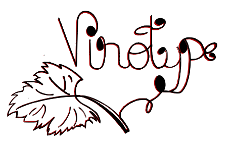

Vinotype is your pocket sommelier, helping you discover wines you will absolutely love. Our personalised recommendations and notes unlock a world of delicious wines, ensuring every bottle is a delightful discovery. Experience the joy of finding wines you truly adore with Vinotype.

Visit the site here Live site: [https://dinacoding.github.io/vinotype/](https://dinacoding.github.io/vinotype/)

## Target Audience

Vinotype's target audience spans a wide range of individuals with ages between 24-65. It is categorised by three distinct groups Wine lovers and explorers that seek new discoveries and personalised recommendations, Wine Enthusiasts that enjoy wine in social occasions and for Wine retail professionals.

The intuitive website offers a detailed wine information, assisting users to make informed choices and 
deepen their wine knowledge.

It also empowers the users of all levels, whether you are seeking new varieties, or simply looking to enhance your knowledge. Its detailed information and vast library/ inventory to guide users on their wine
journey.

## User Experience (UX)

### User goals 

* **Wine Enthusiast:** A user who wants to find a good wine - this is the primary goal.
* **Learn about wine:**  User wants to increase his knowledge through searching the wine  and explore 
recommendations.
* **Discover new varietals:** Users may want to expand their palates and try wines they wouldn't normally consider.

### User Stories 

* **As a Wine Enthusiast**, I want to search about my wine preferences so that I can receive personalized recommendations for new wines to try.
* **As an Occasional Wine Drinker**, I want to easily find wines that are generally considered "the best" so that I can impress my guests at a dinner party.
* **As a Restaurant Owner**, I want to use Vinotype to identify wines that will appeal to my target guests and clients and complement my menu so that I can create a compelling wine list.
* **As a Wine Enthusiast**, I want to learn more about the wines recommended to me so that I can deepen my knowledge and appreciation of wine.

### Scenarios

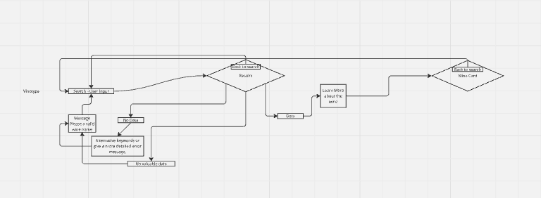

1. **The user enters a wine name**
- The input is valid, the system proceeds with the search.
- If valuable data is found, the system proceeds.
- If the search returns useful data, the user is given the option to "Learn more about the wine."
- After learning more about the wine, the user is presented with a "Wine Card."
- The user has the option to go back to search if needed.

2. **User enters a correct wine name but finds insufficient details:**
- The user enters a valid wine name.
- The system searches for results.
- The system finds data but determines it is "No valuable data."
- The user is informed that no valuable data exists.
- The user is redirected back to the search to try again.

3. **User searches for a wine, explores details, but decides to search again**
- The user enters a valid wine name.
- The system finds valuable data.
- The user selects "Learn More about the wine."
- The user views the Wine Card but decides to go Back to Search instead of proceeding further.
- The system returns to the search step for another attempt.

4. **User repeatedly enters invalid wine names**
- The user enters an incorrect or invalid wine name.
- The system displays a message: "Please enter a valid wine name."
- The user tries again with another invalid input.
- The system repeats the message.
- If the user continuously enters invalid names, the system could suggest trying alternative keywords or give a more detailed error message.

## Planning 
Vinotype is a web searcher website designed for a practical and fast online searcher. It's functionalities and features are clean and responsive and a search bar will be present and a results display section. Users will be able to select other languages than English. The website will integrate a Internal API built with few wines from different regions, and will provide rating and reviews and a description. It will be built using HTML, CSS and JavaScript. For searching the user can use the wine name, the region or use the type of wine, the results and suggestions will appear on a dropdown below the bar. 
Vinotype ensures a smooth functionality. The website will be deployed via GitHub.

## Features 

1. Navigation bar, responsive for different screen devices and it is position on the top of the webpage. 

* Features the logo on the left 
* Contains the links on the right.

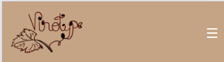

* Menu Toggle functionality
-  Allows users to show or hide the navigation menu when clicking the menu button.

* When clicked a menu drops down

2. Search bar, it is on the content area in the Hero Section 

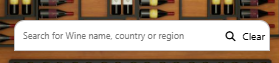

* It allows the user to search for the wine using the name, the region or information about the wine.
- Users can type keywords into a search box.
- The application then filters the wine data to find wines that match the user's input.

- It provides a quick and easy way to find the information
- Displays search results dynamically with filtering in a dropdown list

* Fetches wine data from a wines.json file.
- The application retrieves wine information from an external file named "wines.json".
- The fetch API allows the application to dynamically load data without reloading the entire page.

* Wine search functionality

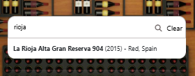

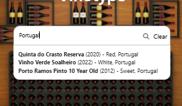

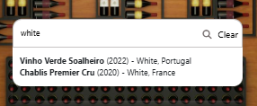

* When the wine is not find is displays a not found message

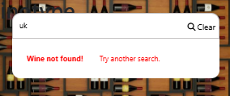

3. Interactivity

* Hides the result box and clears the search when clicking outside the search bar

- Improves usability by automatically closing the search results when the user clicks elsewhere on the page
- Includes a clear button to reset the search and a search button that brings the wine cards

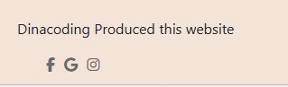

4. Wine and Regions Card

* Generates detailed wine cards dynamically.
* Includes wine image, name, year, color, country, tasting notes, and pairing suggestions.
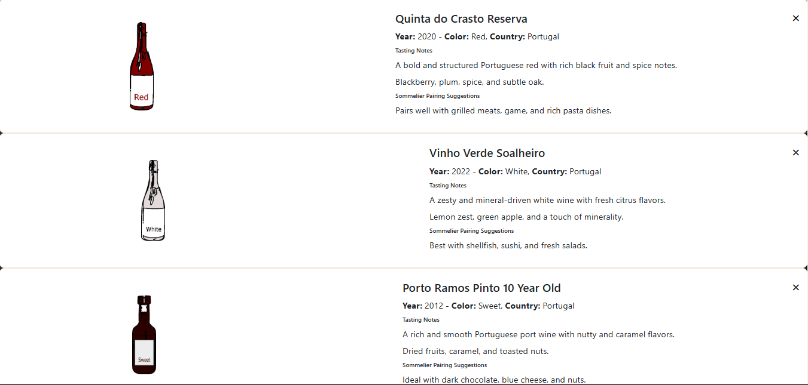
* Adds a close button to remove the wine card.
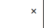

## Wireframes
- Phone
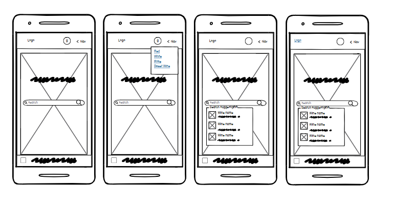
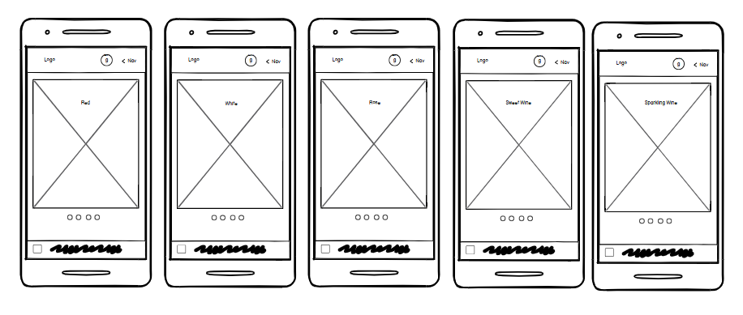

- Tablet
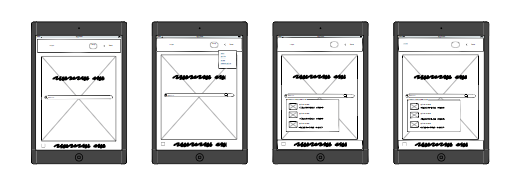
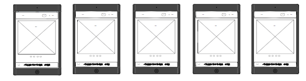

- Desktop
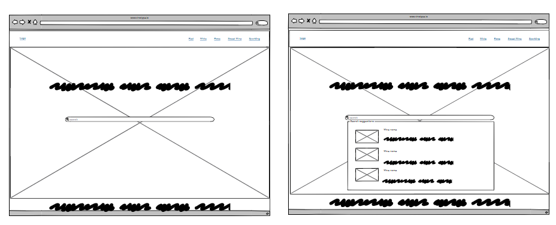
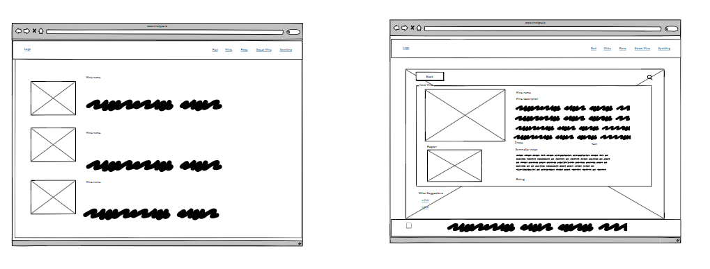

## Designer Choices

Vinotype is design to sustain a visually appealing approach, emphasising warm, elegant tones that embrace the wine theme. The color palette consists of deep reds, warm beiges, and soft peaches. It blends a sense of sophistication and richness, ideal for a wine-related website. It also ensures that the layout stays resposive and is adaptable. It aims to cater the flexible layout ensures responsive adaptability, different screen sizes with well-structured media queries. The root variables allow for easy theme adjustments, while the subtle opacity variations create depth and layering effects. Overall, the design effectively balances aesthetics, readability, and functionality, making it both user-friendly and visually immersive.

### Color scheme

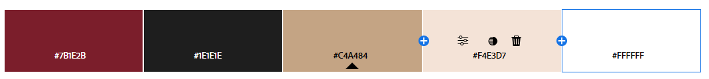

This colour scheme brings the world of wine and creates a sophisticated UX experience. From the deep wine red primary that immerses the passion and the aromatic flavours associated with wine. Age oak add provokes a sense of natural elements and the Rose Beige provides a welcoming element while the Charcoal Black background creates a sleek and modern backdrop. This combination of colors not only aligns with the theme of your wine-focused website but also ensures a user-friendly experience with high contrast and readability.

## Technology used

- [HTML](https://developer.mozilla.org/en-US/docs/Web/HTML), for structure and content writting;
- [CSS](https://developer.mozilla.org/en-US/docs/Web/CSS), for styling and some visual effects;
- [JavaScript](https://developer.mozilla.org/en-US/docs/Web/JavaScript), for interactive elements, dynamic behavior, and enhancing user experience.
- [Inkscape](https://inkscape.org/), to design the logo;
- [Balsamiq](https://balsamiq.com/), used it to wireframe the webpages;
- [ChatGPT](https://chatgpt.com/), to use it to create content for the website and get me a color palette 
- [W3school] (https://www.w3schools.com/) to review some concepts about code;

### Validator Testing 

The HTML and CSS components of the Vinotype web application were subjected to rigorous validation using the W3C Markup Validation Service and the W3C CSS Validation Service, respectively. Both the HTML and CSS documents successfully passed validation, confirming adherence to established web standards. This validation process ensures the structural integrity and cross-browser compatibility of the application. . Compliance with W3C standards contributes to enhanced accessibility, improved performance, and a consistent user experience. The successful validation of the Vinotype application's codebase demonstrates a commitment to quality and best practices in web development.

.png)
.png)

### Future Improvements 

1. Enhanced Typography for Elegance
- Adjust line height and letter spacing for better readability.

2. Animations for Engagement
- Add a smooth fade-in effect when wine cards appear
- Animate the menu toggle for a more dynamic interaction

3. Wine Card Enhancements
- Introduce a carousel or grid layout for wine cards, improving organization.
- Make wine cards expandable, revealing more details on click   

4. Change language button option
- To make your content more accessible to a global audience.
- Language Content Availability: Ensure that you have all necessary content translated and ready for the languages you support.

### How to run this project locally 

1. Download the Git installer:

Windows:

Go to the official Git website: https://git-scm.com/
Click on the "Download for Windows" button.
Run the downloaded installer.
Follow the on-screen instructions. It's generally recommended to use the default options during installation.
macOS:

The easiest way is to use Homebrew:
Open Terminal.
Type brew install git and press Enter.
If you don't have Homebrew, install it first using the instructions on their website: https://brew.sh/
Linux:

Git is usually available through your distribution's package manager.
For Ubuntu/Debian, use sudo apt update and then sudo apt install git.
For Fedora/CentOS, use sudo dnf install git.
For Arch Linux, use pacman -S git.
2. Verify installation:

Open your terminal or command prompt.
Type git --version and press Enter.
If Git is installed correctly, you'll see the installed Git version displayed.

### To clone this project from GitHub:

1. Follow this link to the Project GitHub repository.
2. Under the repository name, click "Clone or download."
3. In the "Clone with HTTPS" section, copy the clone URL for the repository.
4. In your local IDE, open Git Bash.
5. Change the current working directory to the location where you want the cloned directory to be made.
6. Type git clone, and then paste the URL you copied in Step 3.