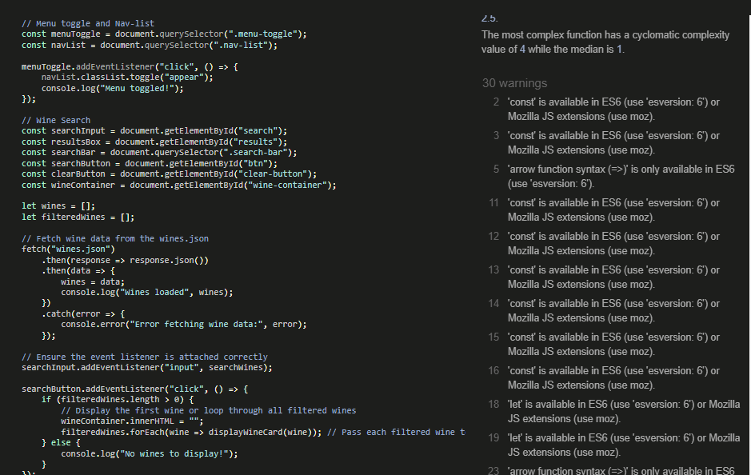
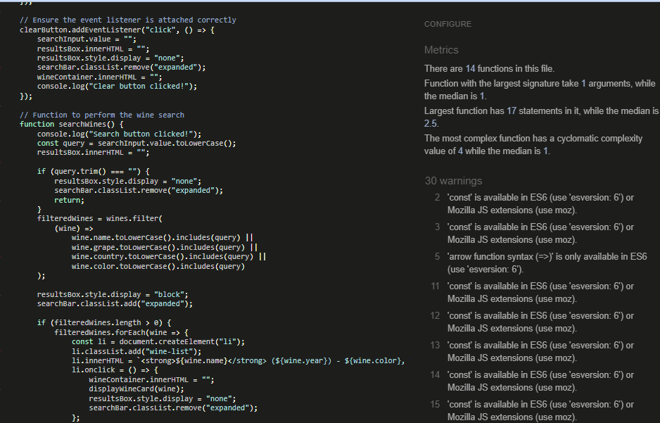
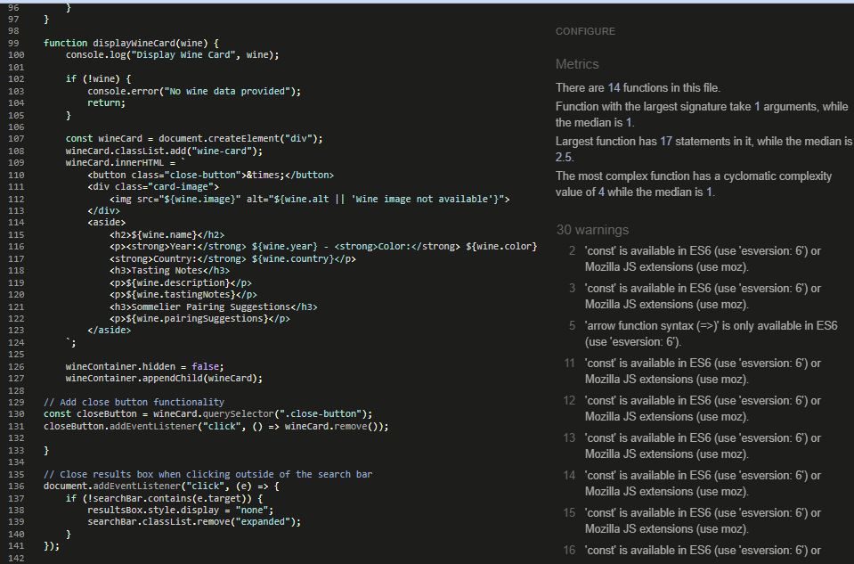
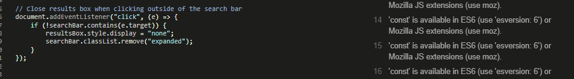

## Testing

### Functionality testing

| **Description of Test**                                           | **Passed (Yes/No)** | **Notes or Comments**                         |
|-------------------------------------------------------------------|---------------------|-----------------------------------------------|
| Is git setup and running in your VsCode editor | Yes | Tested and confirmed|
| Meta Tags are descriptive and they are present in file page | Yes                 | They are present and cohesive.                |
| Favicon is displaying correctly on the tab| Yes                | It is displaying and functional
| BootStrap link is on the index.html page| Yes                | It is displaying and functional
| Create a list of variables in style.css | Yes                | It is on the top of the page|
| Display hamburger menu icon using Unidcode| Yes              | It is displaying correctly|
| Install the npm Jest into the project| Yes                   | It is installed correctly|
| Hamburger menu is responsive and toggle has been updated with JavaScript| Yes | Tested and confirmed|
| Data is being used on the display an array with wines| Yes| It has been tested in the console|
| Message of error fetching the data on the fetch function| Yes| It has been tested in the console|
| Live Link is present in the README.md | Yes                  | It is present and working|
| The button clear, removes all the results| Yes | It works and removes the results|
| Footer contains the social links and they redirect to the correct webpages| Yes| Accessibility and they redirect|
| Message of Wine not found appears if the wine is not present on the list | Yes | It appears on red below the search-bar|
| Wine.json has been updated to include pairing suggestions and tasting notes| Yes | It was updated and it is included in the index.js file|
|Test the console.log of the displayWineCard function, wine container and wineCard| Yes | Tested in the console|

###  **Responsiveness & Cross-Browser Compatibility**

| **Tested On** | **Status** | **Notes** |
|--------------|-----------|----------|
| Google Chrome | Passed | Fully functional |
| Mozilla Firefox | passed | Fully functional |
| Microsoft Edge | Passed |  |
| Mobile (iOS) | Passed | Responsive layout confirmed |

- [Chrome](documentation/browser-testing/chrome.png)
- [Edge](documentation/browser-testing/chrome.png)
- [Firefox](documentation/browser-testing/firefox.png)
- [IOS](documentation/browser-testing/ios.PNG)

### **Performance & Accessibility Testing**

| **Test Description** | **Status** | **Notes** |
|----------------------|-----------|----------|
| Page load speed | Passed | No significant delays in fetching data |
| Images have descriptive `alt` attributes | Passed | Verified for accessibility |
| Keyboard navigation works as expected | Passed | Users can navigate without a mouse |
| Contrast and readability checks | Passed | Text is legible with appropriate contrast |
| Screen reader compatibility | Passed | Tested with screen reader tools |

### JsHint 

The code has been tested and successfully passes JSHint without any critical issues. It follows modern ES6+ standards, utilizing const and let for variable declarations, ensuring better scope management.

### Lighthouse

On desktop, Vinotype web application demonstrates strong performance, scoring a perfect 100 in both Performance and Best Practices categories in the Lighthouse audit. The application also excels in SEO, achieving a 100 score, indicating excellent search engine optimization. While Accessibility scored a commendable 96, it suggests there's room for minor improvements to ensure a more inclusive user experience. Overall, these results highlight the application's robust technical foundation, efficient loading times, adherence to best web development practices, and strong visibility in search engines.

- [Desktop](documentation/lIghthouse/lighthouse-desktop.png)

On the phone,  web application showcases strong performance in key areas, as evidenced by the Lighthouse audit. Achieving a perfect 100 in both Best Practices and SEO demonstrates excellent adherence to web development standards and robust search engine optimization.  Accessibility scores a commendable 96, indicating a high level of inclusivity with potential for minor enhancements. While Performance scores 91, it still reflects a well-optimised application with room for further improvements to ensure optimal loading times and user experience. Overall, the Vinotype application demonstrates a solid foundation and a commitment to quality across critical web development metrics.

- [Phone](documentation/lighthouse/lighthouse-phone.png)

### JsLint Testing

The JSLint analysis of JavaScript code. The tool has identified several warnings, primarily related to code style and formatting. These include unexpected trailing spaces, lines exceeding 80 characters, and the use of single quotes instead of double quotes. While these warnings suggest areas for improvement in code readability and maintainability, they do not indicate critical errors that would prevent the JavaScript code from functioning. The warnings are stylistic suggestions and best practices, not indicators of broken or compromised functionality. The code's core logic, including DOM manipulation and event handling, remains intact.

- [Jslint](documentation/JSlint.png)

### Validator Testing 

The HTML and CSS components of the Vinotype web application were subjected to rigorous validation using the W3C Markup Validation Service and the W3C CSS Validation Service, respectively. Both the HTML and CSS documents successfully passed validation, confirming adherence to established web standards. This validation process ensures the structural integrity and cross-browser compatibility of the application. . Compliance with W3C standards contributes to enhanced accessibility, improved performance, and a consistent user experience. The successful validation of the Vinotype application's codebase demonstrates a commitment to quality and best practices in web development.

.png)
.png)
